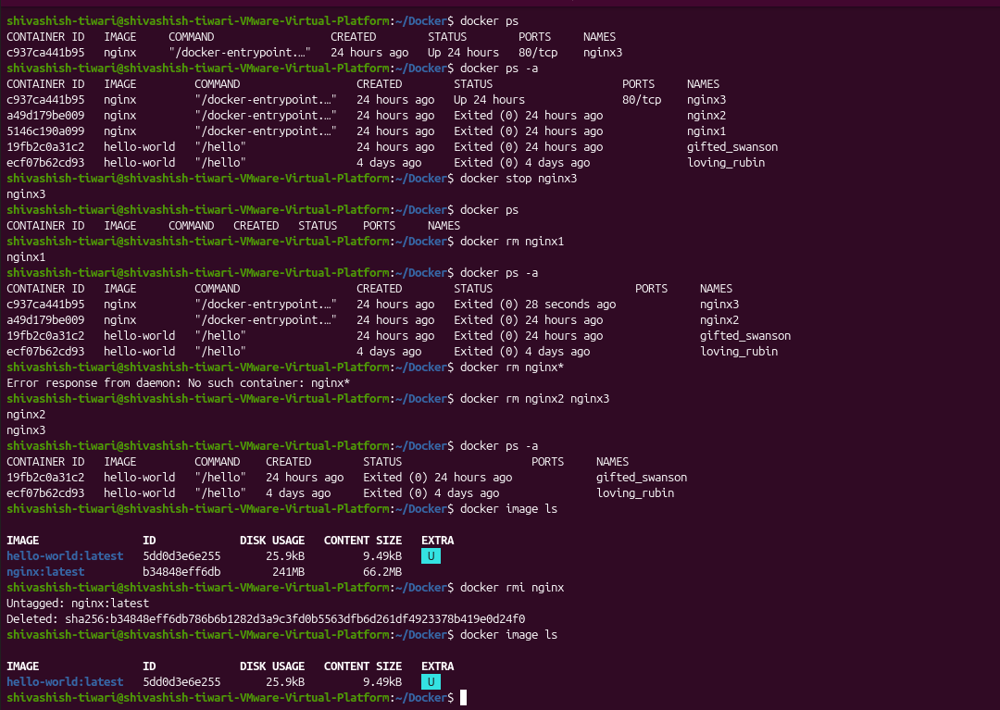

# Docker Exercise 1.1 - Getting Started

## Question

Since we already did "Hello, World!" in the material, let's do something else.

Start **3 containers** from an image that does not automatically exit (such as `nginx`) in detached mode.

Stop **2 containers** and leave **1 container running**.

### Answer

#### i) Commands Used

    docker run -d --name nginx1 nginx
    docker run -d --name nginx2 nginx
    docker run -d --name nginx3 nginx

    docker stop nginx1
    docker stop nginx2

#### ii) Output

# Docker Exercise 1.2 - Cleanup

## Question

Stop all your containers.

Remove all unused containers and images to clean the Docker daemon.

> If you have other projects that should not be removed, use `grep` (or similar filtering) to select only the required containers/images.

### Answer

#### i) Commands Used

    docker stop $(docker ps -q)
    docker rm $(docker ps -aq)
    docker rmi $(docker images -q)

#### ii) Output After Cleanup

### `docker ps -a`

### `docker image ls`

