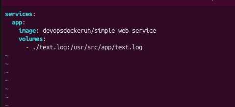

# Exercise 2.1 — Simple Service Writing to Log

## Objective

Create a `docker-compose.yaml` file that starts:

    devopsdockeruh/simple-web-service

The service writes logs to:

    /usr/src/app/text.log

The log file should be saved to the host filesystem using a volume.

## docker-compose.yaml

    services:
      simple-web-service:
        image: devopsdockeruh/simple-web-service
        volumes:
          - ./text.log:/usr/src/app/text.log

## Run

    docker compose up

The service will start and write its logs to:

    ./text.log

### Compose File

