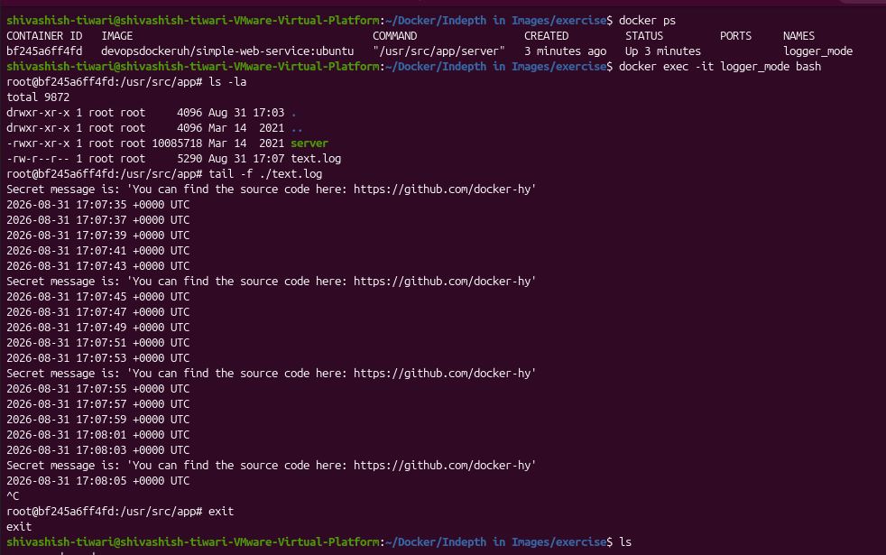
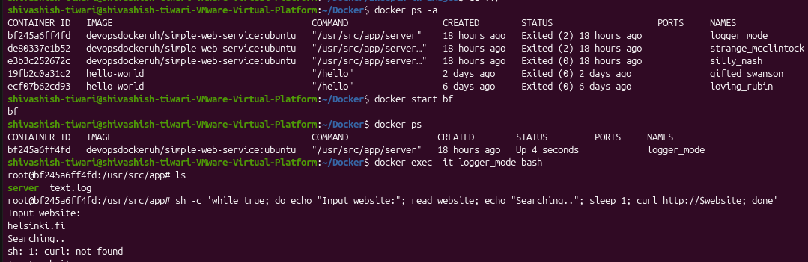
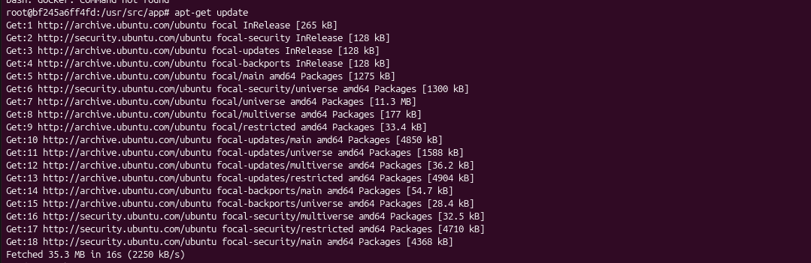
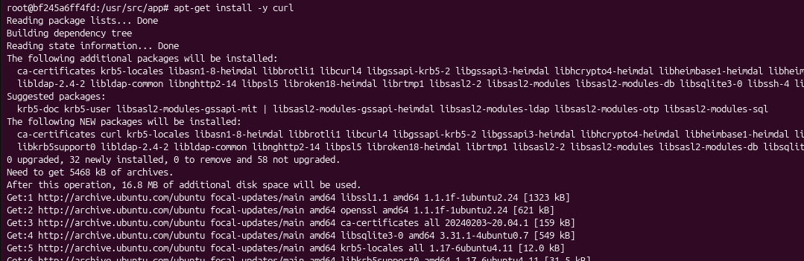
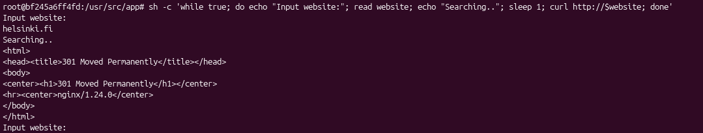
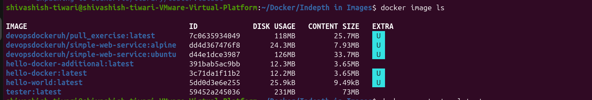
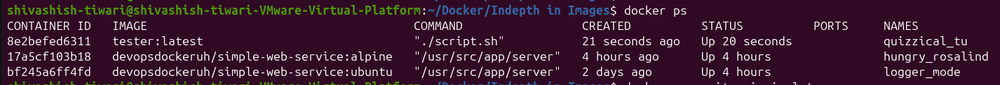
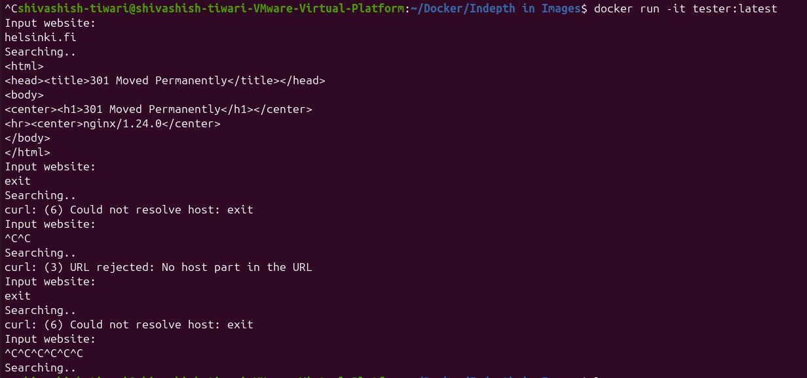

# Docker Exercise 1.3 - Secret Message

## Question

Run `devopsdockeruh/simple-web-service:ubuntu`, enter the running container, and follow `./text.log` using `tail -f`.

Every 10 seconds, a **secret message** appears.

## Answer

### Commands Used

    docker run -d --name logger_mode devopsdockeruh/simple-web-service:ubuntu
    docker exec -it logger_mode bash
    tail -f ./text.log

### Output

# Docker Exercise 1.4 - Missing Dependencies

## Question

Start an Ubuntu container and run the given script. The script uses `curl` to access a website, but `curl` is missing.

## Answer

### i) Command Used to Start the Process

    docker run -it ubuntu sh -c 'while true; do echo "Input website:"; read website; echo "Searching.."; sleep 1; curl http://$website; done'

### ii) Commands Used to Fix the Problem

Install `curl` inside the running container:

    docker exec -it <container_id_or_name> bash

    apt-get update
    apt-get install -y curl

Then enter:

    helsinki.fi

### Output

### docker exec -it logger_mode bash

### apt-get update

### apt-get install -y curl

### sh -c 'while true; do echo "Input website:"; read website; echo "Searching.."; sleep 1; curl http://$website; done'

# Docker Exercise 1.7 - Image for Script

## Question

Create a Docker image based on `ubuntu:24.04` that:

1. Installs `curl`
2. Copies `script.sh` into the image
3. Runs the script when the container starts
4. Builds the image with the name `curler`

## `script.sh`

    #!/bin/bash
    while true
    do
      echo "Input website:"
      read website; echo "Searching.."
      sleep 1; curl http://$website
    done

## Dockerfile

    FROM ubuntu:24.04

    RUN apt-get update && apt-get install -y curl

    COPY script.sh /script.sh

    RUN chmod +x /script.sh

    CMD ["/script.sh"]

## Build & Run

    docker build -t curler .
    docker run -it curler

## Output

> **Remember:** `FROM` → base image, `RUN` → install/setup, `COPY` → add files, `CMD` → command executed when the container starts.
