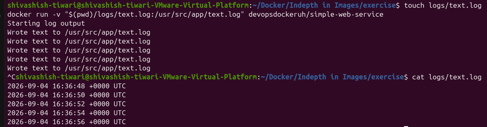

# Docker Exercise 1.9 - Volumes

## Question

The image `devopsdockeruh/simple-web-service` creates a timestamp every 2 seconds in:

    /usr/src/app/text.log

Start the container with a **bind mount** so that `text.log` is created and updated on your local filesystem.

## Answer

### Commands Used

    mkdir logs

    docker run -v "$(pwd)/logs/text.log:/usr/src/app/text.log" devopsdockeruh/simple-web-service

> On Windows PowerShell, you can use:

    docker run -v "${PWD}/logs:/usr/src/app" devopsdockeruh/simple-web-service

The generated `text.log` file will appear inside the local `logs` directory.

### Output

# Docker Exercise 1.10 - Ports Open

## Question

The image `devopsdockeruh/simple-web-service` starts a web service on port `8080` when given the argument `server`.

Use the `-p` flag to make the service accessible through:

    http://localhost:8080

### Answer

Start the service with:

    docker run -p 8080:8080 devopsdockeruh/simple-web-service server

Then open:

    http://localhost:8080

> `-p 8080:8080` maps **host port 8080 → container port 8080**.
