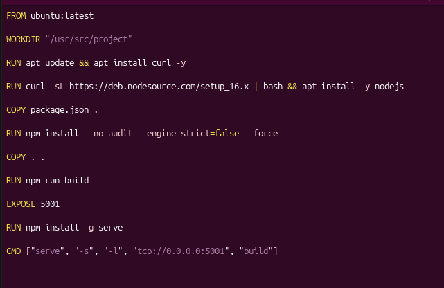
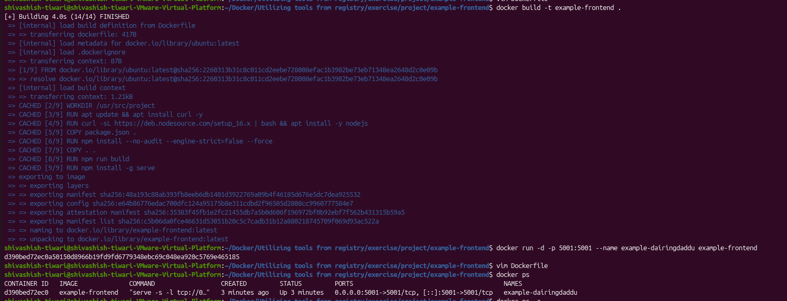
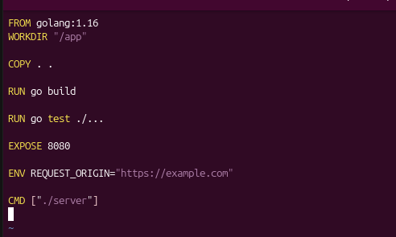
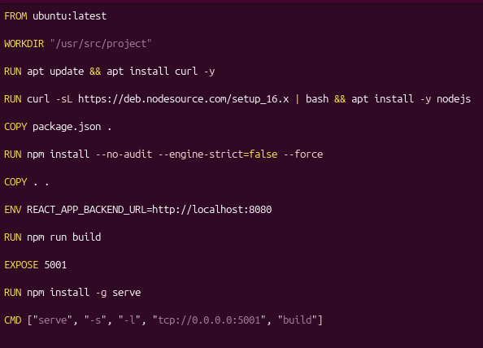
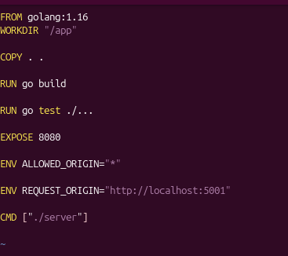
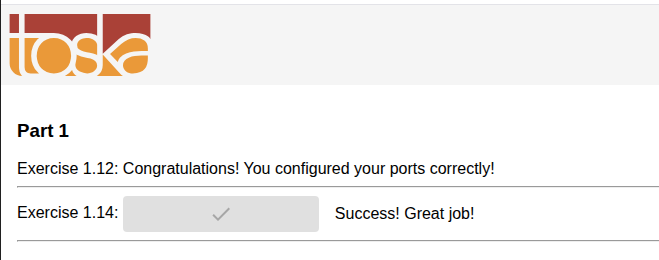

# Exercise 1.11 — Spring

## Dockerfile

    FROM amazoncorretto:8

    WORKDIR /usr/src/app

    COPY . .

    RUN chmod +x mvnw
    RUN ./mvnw package

    EXPOSE 8080

    CMD ["java", "-jar", "./target/docker-example-1.1.3.jar"]

## Build the Image

    docker build -t spring-example .

## Run the Container

    docker run -p 8080:8080 spring-example

## Open in Browser

    http://localhost:8080

The application should display a **Success** message.

## Key Points

- `amazoncorretto:8` provides Java 8.
- `WORKDIR` sets the working directory inside the container.
- `COPY . .` copies the Spring project into the container.
- `./mvnw package` builds the Spring application.
- `EXPOSE 8080` documents the application's port.
- `-p 8080:8080` maps the container's port to the host.
- `CMD` starts the generated JAR file.

# Exercise 1.12 — Hello Frontend

## Project

Example Frontend:

https://github.com/docker-hy/material-applications/tree/main/example-frontend

The task is to containerize the project using **Ubuntu as the base image** without modifying the project code.

## Dockerfile

    FROM ubuntu:latest

    WORKDIR /usr/src/app

    # Install required packages
    RUN apt-get update && apt-get install -y \
        curl \
        nodejs \
        npm

    # Copy project files
    COPY . .

    # Install project dependencies
    RUN npm install

    # Start the application
    CMD ["npm", "start"]

    EXPOSE 5001

## Build the Image

    docker build -t example-frontend .

## Run the Container

    docker run -p 5001:5001 example-frontend

## Open in Browser

    http://localhost:5001

The application should display the success message once it has started accepting connections.

## Important Notes

- Ubuntu must be used as the base image.
- The application may take a few seconds to start.
- Wait until you see:

      Accepting connections at http://localhost:5001

- The project may not work with the newest Node.js versions.
- Nothing needs to be installed outside the container.

## Key Dockerfile Instructions

| Instruction | Purpose |
|---|---|
| `FROM ubuntu:latest` | Uses Ubuntu as the base image |
| `WORKDIR` | Sets the working directory |
| `RUN` | Installs required software and dependencies |
| `COPY` | Copies the project into the image |
| `EXPOSE 5001` | Documents the application port |
| `CMD` | Starts the frontend application |

## Commands Summary

    docker build -t example-frontend .
    docker run -p 5001:5001 example-frontend

# Exercise 1.13 — Hello Backend

## Project

Example Backend:

https://github.com/docker-hy/material-applications/tree/main/example-backend

The goal is to create a Dockerfile for the backend and run it with port `8080` published.

After starting the container, open:

    http://localhost:8080/ping

Expected response:

    pong

## Dockerfile

    FROM ubuntu:latest

    # Copy the project into the container
    COPY . .

    # Install required packages and Go 1.16.3
    RUN apt-get update && \
        apt-get install -y wget gcc && \
        rm -rf /usr/local/go && \
        wget -c https://golang.org/dl/go1.16.3.linux-amd64.tar.gz && \
        tar -C /usr/local -xzf go1.16.3.linux-amd64.tar.gz

    # Add Go to PATH
    ENV PATH /usr/local/go/bin:$PATH

    # Build the application
    RUN go build

    # Run tests
    RUN go test

    # Start the server
    CMD ./server

    # Application port
    EXPOSE 8080

## Build the Image

    docker build -t hello-backend .

### M1/M2/M-series Mac

Use the following when building on an ARM-based Mac:

    docker build --platform linux/amd64 -t hello-backend .

## Run the Container

    docker run -d -p 8080:8080 hello-backend

## Test

Open in your browser:

    http://localhost:8080/ping

Or use:

    curl http://localhost:8080/ping

Expected output:

    pong

## Key Dockerfile Instructions

| Instruction | Purpose |
|---|---|
| `FROM ubuntu:latest` | Uses Ubuntu as the base image |
| `COPY . .` | Copies the backend project into the image |
| `RUN` | Installs Go and builds/tests the application |
| `ENV PATH` | Makes Go available through the PATH |
| `CMD` | Starts the backend server |
| `EXPOSE 8080` | Documents the application's port |
| `-p 8080:8080` | Publishes container port 8080 to the host |

## Commands Summary

    docker build -t hello-backend .
    docker run -d -p 8080:8080 hello-backend

For M1/M2/M-series Mac:

    docker build --platform linux/amd64 -t hello-backend .
    docker run -d -p 8080:8080 hello-backend

### Dockerfile

### Output

# Exercise 1.14 — Environment

## Objective

Run both the **frontend** and **backend** containers with the correct ports and configure them using Dockerfile `ENV` variables.

The frontend runs in the browser and sends the request to:

    backend_url/ping

The configuration is correct when the **Exercise 1.14** button turns green.

## Frontend Dockerfile

    FROM ubuntu:latest

    WORKDIR /usr/src

    COPY . .

    # Backend URL used by the frontend browser code
    ENV REACT_APP_BACKEND_URL http://localhost:8080/

    RUN apt-get update && \
        apt-get install -y curl && \
        curl https://deb.nodesource.com/setup_14.x | bash - && \
        apt-get install -y nodejs

    RUN apt-get install -y npm && \
        npm install && \
        npm run build && \
        npm install -g serve

    CMD ["npx", "serve", "-s", "-l", "5000", "build"]

    EXPOSE 5000

## Backend Dockerfile

    FROM ubuntu:latest

    COPY . .

    RUN apt-get update && \
        apt-get install -y wget gcc && \
        rm -rf /usr/local/go && \
        wget -c https://golang.org/dl/go1.16.3.linux-amd64.tar.gz && \
        tar -C /usr/local -xzf go1.16.3.linux-amd64.tar.gz

    # Add Go to PATH
    ENV PATH /usr/local/go/bin:$PATH

    # Allow requests from the frontend
    ENV REQUEST_ORIGIN http://localhost:5000

    RUN go build

    RUN go test

    CMD ./server

    EXPOSE 8080

## Build the Backend

    cd example-backend
    docker build -t hello-backend .

## Run the Backend

    docker run -d -p 8080:8080 hello-backend

The backend is now available at:

    http://localhost:8080

Test it with:

    http://localhost:8080/ping

Expected response:

    pong

## Build the Frontend

    cd example-frontend
    docker build -t hello-frontend .

## Run the Frontend

    docker run -d -p 5000:5000 hello-frontend

Open:

    http://localhost:5000

Then press the **1.14** button.

The button should turn **green**.

## Environment Variables

### Frontend

    ENV REACT_APP_BACKEND_URL http://localhost:8080/

The frontend README states that `REACT_APP_BACKEND_URL` controls the API path used when the frontend is built. :contentReference[oaicite:0]{index=0}

### Backend

    ENV REQUEST_ORIGIN http://localhost:5000

The backend README states that `REQUEST_ORIGIN` is used for the CORS check. :contentReference[oaicite:1]{index=1}

## Why localhost?

The frontend JavaScript is executed by the **browser**, not inside the frontend container.

Therefore:

    Browser
       |
       | http://localhost:5000
       v
    Frontend Container
       |
       | Browser sends request to http://localhost:8080/ping
       v
    Backend Container

The frontend must therefore use:

    http://localhost:8080/

and the backend must allow:

    http://localhost:5000

## Commands Summary

### Backend

    cd example-backend
    docker build -t hello-backend .
    docker run -d -p 8080:8080 hello-backend

### Frontend

    cd example-frontend
    docker build -t hello-frontend .
    docker run -d -p 5000:5000 hello-frontend

## Important

- Do not modify the application source code.
- `EXPOSE` documents the container port.
- `-p` publishes the port to the host.
- `REACT_APP_BACKEND_URL` is needed by the frontend.
- `REQUEST_ORIGIN` is needed by the backend for CORS.
- Keep the browser Developer Tools (`F12`) open, especially the **Console** and **Network** tabs, when debugging.

## Quick Reference

    Frontend port  : 5000
    Backend port   : 8080

    Frontend ENV:
    REACT_APP_BACKEND_URL=http://localhost:8080/

    Backend ENV:
    REQUEST_ORIGIN=http://localhost:5000

    Frontend URL:
    http://localhost:5000

    Backend test:
    http://localhost:8080/ping

